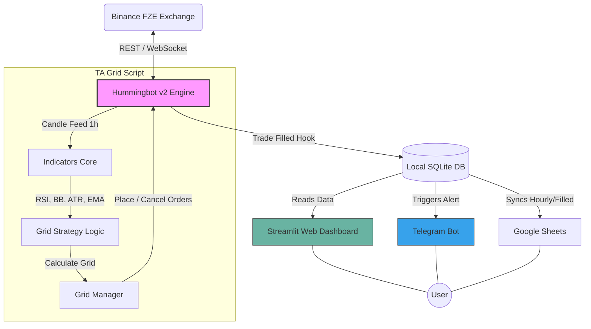

# 🏗️ System Architecture & App Visuals

This document outlines the architecture of the **TA-Enhanced BTC/USDT Grid Bot** and provides a preview of how the user interface (the web dashboard) will look.

## 1️⃣ How the Web Dashboard Will Look

The primary way you will interact visually with the bot is through the **Streamlit Web Dashboard** (`src/dashboard/app.py`). Here is a conceptual mockup of the dark-mode UI:


### Dashboard Layout & Features
* **Top Summary Cards**: 6 key metrics prominently displayed at the top. (e.g., Today's PnL, Win Rate, Total Trades, Weekly PnL, Monthly PnL, Max Drawdown).
* **Equity Curve Chart**: A large, central line graph plotting your portfolio growth over time.
* **Trade History Data Table**: A detailed table at the bottom showcasing every trade, filterable by status with conditional formatting (Green rows for wins ✅, Red rows for losses ❌).

---

## 2️⃣ How the Mobile Alerts Will Look (Telegram)

The secondary UI is your mobile device via Telegram. Alerts are pushed in real-time.

```text
💚 Trade Closed — BTC/USDT
━━━━━━━━━━━━━━━━━━━━━━
📈 BUY  |  Grid Level 3
⏱ Duration:    45 min
🔵 Entry:      $98,200.00
🔵 Exit:       $99,100.00
📦 Qty:        0.001 BTC
━━━━━━━━━━━━━━━━━━━━━━
💰 Gross PnL:  +$0.90
💸 Fee:        -$0.19
📊 Net PnL:    +$0.71
━━━━━━━━━━━━━━━━━━━━━━
RSI: 42.3  |  Grid: ACTIVE
```

---

## 3️⃣ System Architecture Flow

The following Mermaid diagram outlines the data flow between Hummingbot, the TA indicators, Binance, and the various notification/dashboard interfaces.



### Component Breakdown
1. **Hummingbot v2 Engine**: Handles the low-level connection to Binance, executing orders, and maintaining the exchange connection.
2. **Indicator Core (`src/indicators`)**: Fetches market data using the `candle_feed` to calculate RSI, Bollinger Bands, ATR, and EMA real-time.
3. **Local SQLite (`trade_journal.py`)**: Stores raw tick and trade data, enabling all three visual features. 
4. **Google Sheets Sync (`sheets_sync.py`)**: A backend cron-like script continuously running to mirror SQLite to cloud Sheets.
5. **Streamlit App (`app.py`)**: The standalone web process reading from SQLite to generate the real-time UI.
