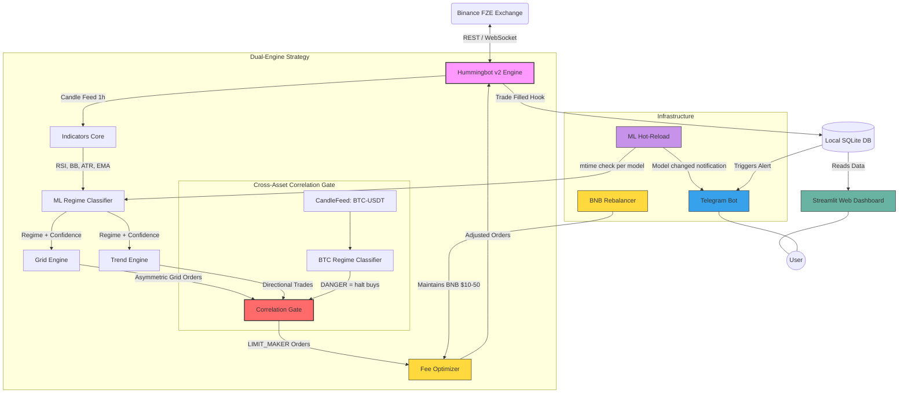

# System Architecture & App Visuals

This document outlines the architecture of the **TA-Enhanced Multi-Pair Grid + Trend Bot** and provides a preview of how the user interface (the web dashboard) looks.

## 1. How the Web Dashboard Looks

The primary way you interact visually with the bot is through the **Streamlit Web Dashboard** (`app.py`). A dark-mode UI with:

### Dashboard Layout & Features
* **Top Summary Cards**: Key metrics prominently displayed (Today's PnL, Win Rate, Total Trades, Weekly PnL, Monthly PnL, Max Drawdown).
* **Equity Curve Chart**: Line graph plotting portfolio growth over time.
* **Trade History Data Table**: Detailed table of every trade, filterable by pair and status with conditional formatting (Green rows for wins, Red rows for losses).

---

## 2. How the Mobile Alerts Look (Telegram)

Alerts are pushed in real-time via Telegram.

```text
💚 Trade Closed — ETH/USDT
━━━━━━━━━━━━━━━━━━━━━━
📈 BUY  |  Grid Level 3
⏱ Duration:    45 min
🔵 Entry:      $2,450.00
🔵 Exit:       $2,478.50
📦 Qty:        0.02 ETH
━━━━━━━━━━━━━━━━━━━━━━
💰 Gross PnL:  +$0.57
💸 Fee:        -$0.12
📊 Net PnL:    +$0.45
━━━━━━━━━━━━━━━━━━━━━━
RSI: 42.3  |  Grid: ACTIVE  |  Regime: RANGING
```

---

## 3. System Architecture Flow



### Component Breakdown
1. **Hummingbot v2 Engine**: Handles the low-level connection to Binance, executing orders across multiple pairs, and maintaining the exchange connection.
2. **Indicator Core (`src/indicators`)**: Calculates RSI, Bollinger Bands, ATR, and EMA per pair from 1-hour candle data.
3. **ML Regime Classifier (`src/ml/`)**: Per-pair Random Forest models classifying market regime as RANGING, TRENDING, or DANGER.
4. **Grid Engine (`src/grid/`)**: Asymmetric grid with geometric buy-side spacing. Capital scales based on ML regime.
5. **Trend Engine (`src/trend/`)**: Directional trades with trailing stops and confidence-weighted position sizing. Only active in TRENDING regime. Risk scales 0.5%-3% based on ML confidence score.
6. **Capital Manager (`capital_manager.py`)**: Allocates capital across pairs with configurable per-pair limits.
7. **Cross-Asset ML Correlation Gate**: BTC-USDT is always loaded as a systemic risk signal (even when BTC trading is disabled). When BTC regime = DANGER, all altcoin buy-side operations halt immediately. Sell orders remain unaffected. BTC candle data is fetched via a dedicated CandleFeed independent of traded pairs.
8. **Dynamic Fee Optimizer**: All orders (grid and trend) use LIMIT_MAKER (post-only) to guarantee maker fee rate. Configured in the `fee_optimization` section of strategy.yaml.
9. **BNB Rebalancer (`src/risk/bnb_rebalancer.py`)**: Maintains BNB balance in the $10-50 range to qualify for the 25% Binance fee discount. Automatically rebalances when balance drifts outside the target window.
10. **ML Model Hot-Reload**: Tracks file modification time (mtime) per model file. On each indicator refresh cycle, checks for changes. When a model file is updated, loads the new model, validates it, logs the event, and sends a Telegram notification. Zero downtime -- no restart required.
11. **Auto-Retraining Pipeline**: Two GitHub Actions workflows manage model lifecycle:
    - `.github/workflows/sweep.yml` -- Weekly (Sunday 00:00 UTC) VectorBT parameter sweeps to find optimal grid/trend parameters.
    - `.github/workflows/retrain.yml` -- Monthly (1st of month) ML model retraining with accuracy gating. Both workflows commit results with `[skip ci]` to avoid cascading builds.
12. **Per-Pair State Isolation**: Each pair maintains its own open buys, unmatched sells, initial equity, grid throttle timer, and compound scaling. Grid state is saved/loaded per pair with no cross-contamination. Fill matching only pairs buys and sells from the same trading pair.
13. **Local SQLite (`trade_journal.py`)**: Stores trade data for all pairs with indicator snapshots.
14. **Streamlit App (`app.py`)**: Web dashboard reading from SQLite with multi-pair views.
15. **Telegram Bot (`src/notifications/`)**: Real-time alerts and interactive commands for monitoring and control.
