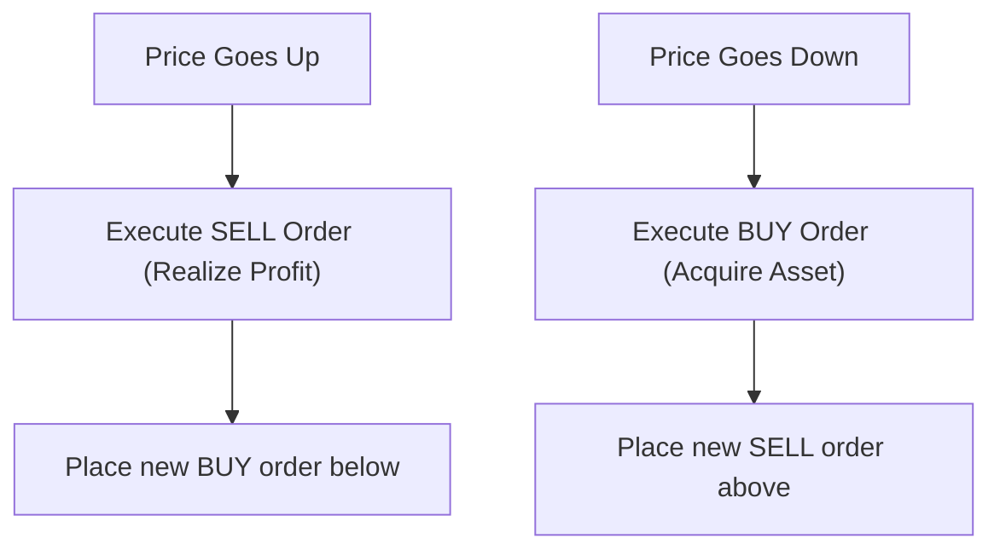

# 🧠 Grid & Profit Strategy Guide

This document breaks down the core logic of how the bot places trades (Grid Strategy) and how it makes money (Profit Strategy).

## 1️⃣ What is a Grid Strategy?

A standard grid trading bot is a quantitative trading algorithm that automates buying and selling within a specific price range. Instead of taking a single large position, the bot divides your capital into many small "grid levels".

### The "TA-Enhanced" Difference
A normal grid bot operates "blind"—it just places 10 lines up and 10 lines down, regardless of market context. **This bot is different.** It is governed by a layer of Technical Analysis (TA) that drastically improves its safety and efficiency:

*   **Dynamic Floors & Ceilings:** It uses the **Bollinger Bands (20, 2)** to automatically locate the current market range. It won't place orders randomly; it only places grids inside the mathematical support (Lower Band) and resistance (Upper Band).
*   **Adaptive Spacing:** Market chop changing? The bot uses the **ATR (Average True Range)**. If Bitcoin is exploding in volatility, the bot spreads the orders out to avoid catching falling knives. If the market is completely flat, the bot tightens the orders up to catch microscopic bounces.
*   **The Kill Switch:** If the market enters panic mode (`Price < EMA 200` or `RSI > 70`), the grid **pauses itself**, cancels all pending open orders, and waits for the danger to pass.
*   **RSI Level Filtering:** Even when the grid is ACTIVE, individual levels are filtered by RSI. Buy levels are skipped when `RSI > 60` (market already overbought) and sell levels are skipped when `RSI < 40` (market oversold, wait for bounce). This prevents placing counter-trend orders. 

---

## 2️⃣ The Profit Strategy

The bot does not care if Bitcoin eventually goes to $200k or drops to $50k—it profits strictly off of **volatility** (the bouncing motion). Every time price triggers a Buy order, the bot generates a paired Sell order slightly higher. When that Sell order hits, you lock in a tiny piece of profit. 

The strategy relies on the law of large numbers: hitting a $0.30 profit hundreds of times a week.

### 💰 Maximizing Profit & Beating the Break-Even
Because the bot takes many micro-trades, the absolute biggest threat to your profitability is **Exchange Fees**. 

To maximize the bot's net yield, your profit strategy relies on three pillars:
1.  **Fee Destruction (Binance BNB Discount):** You must purchase $15 of BNB and enable BNB fee payments in your Binance profile. This reduces your trading fee by 25% (down to `0.075%`). If you skip this, the exchange will consume a massive chunk of your gross profits.
2.  **Wide vs. Tight Grids:** If you cram 50 orders extremely close together, your bot will fire 100 times a day—but your fees will be staggering, and the profit per trade will be microscopic. This strategy uses **6 levels** with an ATR spacing multiplier of `1.5` to force the bot to take *fewer, but highly profitable* quality trades. Each round-trip captures more spread, making it easier to beat fees.
3.  **Active Peak Hours:** As noted in the Market Timing docs, the most dense pocket of algorithmic profit happens between **16:00 and 21:00 (GST)** when US and European volume overlap.

---

## 3️⃣ Capital Scaling & Compounding

**Phase 1: Validation ($200 to $500)**
At minimum capital, the objective isn't to get rich—it's to prove that the bot can consistently generate the **~4.0% to 5.0% monthly return** required to mathematically beat server costs and exchange fees. 

**Phase 2: Compounding ($1,000+)**
As you scale to $1,000 capital, the break-even math gets significantly easier (it only requires a **+3.35% monthly return**). At this stage, the profit strategy shifts to compounding:
*   Instead of withdrawing the weekly yield, the bot’s `$1,000` capital slowly becomes `$1,050`, then `$1,110`. 
*   Because order sizes are defined mathematically by dividing the total capital by the number of levels, your $50/order size will naturally swell to $55/order size.
*   Your $0.30 per-trade profit incrementally becomes $0.35, creating an algorithmic snowball effect. 

> [!WARNING]
> **Risk Reality:** Grid bots lose money dynamically when the price crashes directly through the *bottom* of your grid range entirely, leaving you holding bags. This is why the **EMA 200 trend filter** was built into the strategy—if the trend genuinely reverses sideways/upwards to downwards, the bot stops buying.
