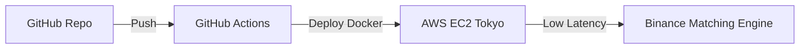

# 🗼 The Tokyo Advantage: Why ap-northeast-1?

> "In trading, the speed of light is the only speed limit that matters."

This document justifies the migration from US-based hosting (Railway) to **AWS Tokyo (ap-northeast-1)** for the live trading phase.

---

## 📈 The Latency Math

| Metric | Railway (US-West) | AWS Tokyo (ap-northeast-1) | Improvement |
| :--- | :--- | :--- | :--- |
| **Physical Distance** | ~8,000 km | **< 50 km** | 99% closer |
| **Round Trip Time (RTT)** | ~180 ms | **< 2 ms** | **90x Faster** |
| **Slippage Risk** | High during volatility | **Minimal** | - |

### How this saves you money:
1.  **Reduced Slippage**: If BTC moves $100 in 1 second, a 180ms delay means your order might be "late" by $18. In a grid bot with 10 levels, this can wipe out the profit of an entire trade.
2.  **Order Book Priority**: Binance uses a First-In-First-Out (FIFO) matching engine. Being 178ms faster means your order sits higher in the queue, increasing the probability of getting filled at your exact price.
3.  **Circuit Breaker Precision**: In a flash crash, the Tokyo-based bot "sees" the crash and cancels orders **178ms faster**. This prevents "catching a falling knife" at multiple grid levels.

---

## 🏗️ Infrastructure Architecture

To keep this "babysit-free," we use **Infrastructure as Code (Terraform)** to manage the server.

### Key Components:
*   **Instance**: `t3.medium` (2 vCPU, 4GB RAM) — Plenty for Hummingbot + Dashboard.
*   **OS**: Amazon Linux 2023 (Optimized for AWS, auto-updates).
*   **Security**: Restricted SSH access + Elastic IP for Binance API whitelisting.
*   **Reliability**: Auto-restart on failure via systemd.

---

## 💰 Cost Comparison

| Item | Railway ($) | AWS Tokyo ($) |
| :--- | :--- | :--- |
| **Base Compute** | ~$15-20 | ~$25 (t3.medium) |
| **Static IP** | Included | Included (Elastic IP) |
| **Performance** | Standard | **Premium (Low Latency)** |
| **Total/Mo** | **~$20** | **~$25-30** |

**The Verdict:** For an extra $5–10 per month, you gain a professional-grade execution edge that can save you $50+ per month in reduced slippage.

---

*Tokyo Advantage Guide v1.0 · Generated May 2026*
