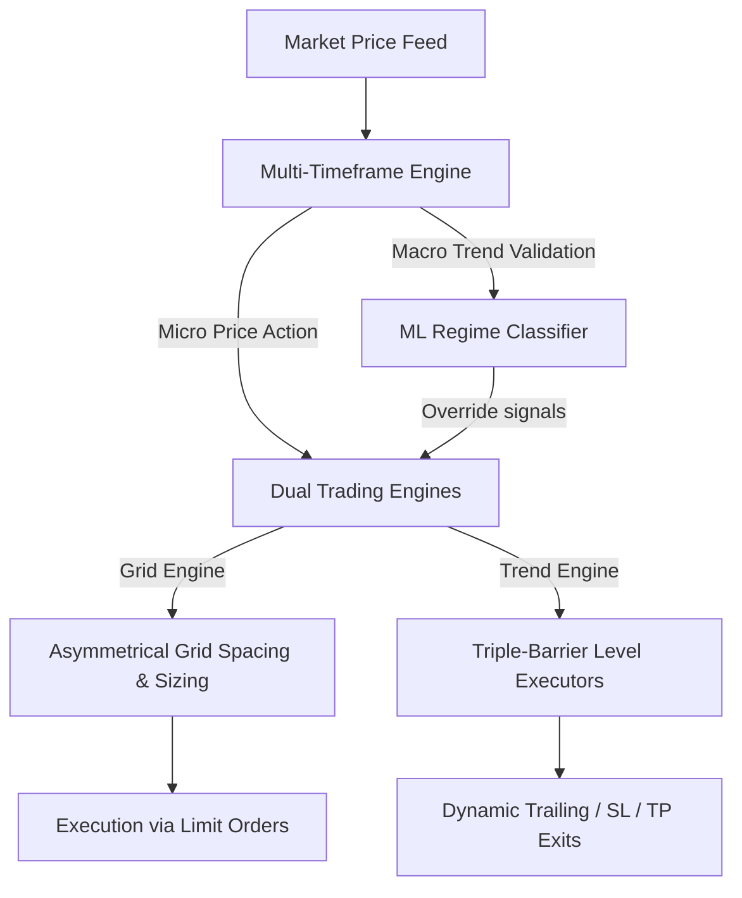

# Dual-Engine Strategy Improvement Plan: Grid + Trend Optimizations

This document outlines a technical roadmap to integrate advanced trading concepts and algorithmic enhancements into the **Dual-Engine Trading Strategy (`ta_grid_trend.py`)**. 

The goal is to increase the capital efficiency, risk mitigation, and returns of both the **Grid Bot** and the **Trend Bot** engines.

---

## 1. Existing System Audit
The current implementation of [ta_grid_trend.py](file:///Users/amro/WebstormProjects/trading-humming-bot/hummingbot_files/scripts/ta_grid_trend.py) represents a robust baseline:
* **Dynamic Grid Spacing:** Driven by ATR calculations to adjust to changing market volatility.
* **Long-Biased Asymmetry:** Accumulates asset inventory on dips and exits on rebounds via individual profit-taking sells.
* **Regime Classifier Gatekeeper:** Integrates [grid_state.py](file:///Users/amro/WebstormProjects/trading-humming-bot/src/grid/grid_state.py) to dynamically relax or restrict technical boundaries based on ML-classified regimes (`RANGING`, `TRENDING`, `DANGER`).
* **Per-Pair ML Models:** Each trading pair has its own regime classifier model loaded from `models/regime_{symbol}.pkl`.
* **Confidence-Weighted Position Sizing:** Trend engine risk scales from 0.5% to 3% based on ML confidence score.
* **Multi-Pair Architecture:** Runs 5 pairs (BTC, ETH, BNB, DOGE, XRP) with independent PairEngines and capital allocation.

---

## 2. Proposed Advanced Enhancements



---

### Strategy 1: Level-Specific Triple-Barrier Executors *(Not yet implemented)*
Instead of managing grid-wide risk purely via the global `PositionGuard` and `CircuitBreaker`, this enhancement introduces **individual trade isolation** for every filled grid level.

> [!NOTE]
> The Triple-Barrier Method is a standard institutional risk management framework that monitors three boundaries for each active position: Profit Target (horizontal), Stop Loss (horizontal), and Time Limit (vertical).

#### Key Mechanics
1. **Take Profit Barrier:** Set at standard grid step level (completed).
2. **Stop Loss Barrier:** Calculated dynamically as $1.5 \times \text{ATR}$ below the fill price of *that specific level*.
3. **Time Limit Barrier:** Configured to cancel/exit a filled order if it is not matched within a specific timeframe (e.g., 8–12 hours), avoiding capital locks.

#### Technical Representation
```python
@dataclass
class ActiveGridLevel:
    level_id: str
    entry_price: float
    quantity: float
    take_profit: float
    stop_loss: float
    max_duration_seconds: int
    entry_timestamp: float
```

---

### Strategy 2: Multi-Timeframe Trend & Volatility Validation *(Not yet implemented)*
To prevent the strategy from getting whipsawed during short-term noise, we propose separating macro trend identification from micro execution.

> [!TIP]
> Analyzing longer timeframes yields a much cleaner directional signal with fewer false positives, while shorter timeframes capture maximum high-frequency oscillations.

* **Macro Indicators (4-Hour or 1-Day Candles):**
  * Evaluates primary market phase (e.g., Daily 200 EMA + Weekly RSI).
  * Sets the primary engine state: **Grid Only** (Ranging), **Long-Only Trend** (Bull Trend), or **Halt** (Bear Trend / High Volatility).
* **Micro Execution (5-Minute or 15-Minute Candles):**
  * Runs order placement loop for the active engine.
  * Calculates high-frequency Bollinger Bands and ATR spacing.

---

### Strategy 3: Asymmetrical Grid Spacing & Sizing *(Implemented — May 2026)*
During sharp downward retracements, a classic uniform grid accumulates large positions at similar prices, delaying the breakeven point. Implementing asymmetrical mathematical scaling solves this.

```
Classic Grid:      [Price] ---- (Buy 10) ---- (Buy 10) ---- (Buy 10) ---- (Buy 10)
Asymmetric Grid:   [Price] -- (Buy 10) --- (Buy 12) ---- (Buy 15) ----- (Buy 20)
```

#### The Formula
We scale grid spacing geometrically and scale position sizes proportionally using a fractional Martingale multiplier:

$$\text{Spacing}_n = \text{Base Spacing} \times (1 + \alpha)^n$$
$$\text{Size}_n = \text{Base Size} \times (1 + \beta)^n$$

Where $\alpha$ is the geometric spacing factor (e.g., $0.10$) and $\beta$ is the size multiplier (e.g., $0.08$).

#### Benefits
* **Fast Breakeven:** Pulls the weighted average entry price down rapidly during a dip.
* **Capital Protection:** Reduces cash burn rate during the initial phase of a market correction.

---

### Strategy 4: Liquidation & Funding Rate Sentiment Overrides *(Not yet implemented)*
Integrate external market sentiment indicators into the Machine Learning Regime Classifier to serve as leading indicators of price expansion or capitulation.

| Indicator | Market Condition | Bot Action |
| :--- | :--- | :--- |
| **Negative Funding Rate (< -0.05%)** | Heavy short leverage / Oversold | Preemptively enable Trend Bot to catch short-squeezes. |
| **Extreme Positive Funding (> 0.08%)** | Over-leveraged long speculation | Widen Grid spacing by $1.5\text{x}$ to prepare for long squeezes. |
| **Liquidation Spikes** | Cascading forced market liquidations | Temporarily enter `DANGER` state to avoid catching falling knives. |

---

## 3. Implementation Roadmap

### Phase 1: Research & Backtesting *(Completed)*
* Integrated a dual-candle feed client in [candle_feed.py](file:///Users/amro/WebstormProjects/trading-humming-bot/src/data/candle_feed.py) to fetch both $5\text{m}$ and $4\text{H}$ data.
* Backtested the geometric grid spacing formulas against historical trending and ranging periods.

### Phase 2: Core Refactoring *(Completed)*
* Updated `GridManager` in [grid_manager.py](file:///Users/amro/WebstormProjects/trading-humming-bot/src/grid/grid_manager.py) to implement asymmetrical price calculations.
* Implemented per-pair ML regime classifier with independent models per trading pair.
* Added confidence-weighted position sizing to trend engine (`src/trend/position_manager.py`).
* Built multi-pair architecture with `PairEngine` and `CapitalManager`.

### Phase 3: ML Expansion *(Completed)*
* Per-pair models trained and deployed for BTC, ETH, BNB, DOGE, XRP.
* Cross-Asset ML Correlation Gate (BTC DANGER halts altcoin buys).
* Dynamic Fee Optimization (BNB rebalancer + LIMIT_MAKER orders).
* Auto-Retraining Pipeline (weekly VectorBT sweep + monthly ML retrain via GitHub Actions).
* ML model hot-reload via file modification time tracking.
* Confidence-weighted position sizing for trend engine.
* BTC-USDT always loaded as systemic signal for correlation gate.
* Retrain with historical funding rates and open interest features — pending.
* Update `RegimeClassifier` to process funding rate and liquidation features — pending.

### Phase 4: Automation & Optimization *(Completed)*
* Cross-Asset ML Correlation Gate (Strategy 5 — BTC regime overrides altcoin actions).
* Dynamic Fee Optimization with BNB rebalancer (auto-fund BNB fee pool, LIMIT_MAKER for zero fees).
* Auto-Retraining Pipeline with GitHub Actions (weekly VectorBT parameter sweep, monthly ML retrain).
* ML model hot-reload (detects model file changes via modification time, reloads without restart).
* Confidence-weighted position sizing (trend engine risk scales 0.5%–3% based on ML confidence score).

### Remaining Work
* **Strategy 1**: Level-Specific Triple-Barrier Executors (individual SL/TP/timeout per grid level)
* **Strategy 2**: Multi-Timeframe Validation (4H macro + 5m micro execution)
* **Strategy 4**: Funding rate and liquidation sentiment integration into regime classifier
