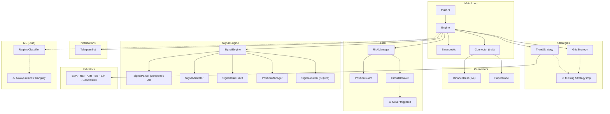

# 🔍 Rust Engine Code Review — `trading-engine-core`

> **Reviewed**: All 35 source files, `Cargo.toml`, 16 test files  
> **Version**: 0.2.0 · **Edition**: Rust 2021 · **LOC**: ~4,200

---

## Executive Summary

The engine is a **well-structured, production-capable** trading system with clean module separation and solid fundamentals. The architecture — strategies as trait objects, connector abstraction, risk management, and a signal copy-trade engine — is sound. However, there are **several bugs, safety gaps, and incomplete features** that could cause real money losses or silent failures in production. Below is a comprehensive breakdown.

### Scorecard

| Area | Rating | Notes |
|------|--------|-------|
| **Architecture** | ⭐⭐⭐⭐ | Clean layering, good trait design |
| **Correctness** | ⭐⭐⭐ | Several logic bugs and dead code paths |
| **Safety** | ⭐⭐⭐ | Mutex patterns need work; `unwrap()` in async code |
| **Error Handling** | ⭐⭐⭐ | Good use of `anyhow`/`thiserror`, but silent swallowing |
| **Testing** | ⭐⭐⭐ | 16 test files exist, but integration coverage is low |
| **Production Readiness** | ⭐⭐ | ML stub, missing graceful shutdown, no metrics |
| **Performance** | ⭐⭐⭐⭐ | Efficient for single-pair; multi-pair needs work |

---

## 🐛 Bugs & Critical Issues

### 1. `estimate_equity()` always returns `capital_usdt` — Dead Logic

**File**: [engine.rs:654-659](file:///Users/amro/WebstormProjects/trading-humming-bot/trading-engine-core/src/engine.rs#L654-L659)

```rust
fn estimate_equity(&self) -> f64 {
    let ob = self.order_books.values().next();
    let price = ob.and_then(|o| o.mid_price()).unwrap_or(0.0);
    // Both branches return the same value!
    if price > 0.0 { self.config.grid.capital_usdt } else { self.config.grid.capital_usdt }
}
```

> [!CAUTION]
> This means `/reset` never actually recalculates equity. The circuit breaker resets to the **initial configured capital** every time, effectively disabling drawdown protection after any gains or losses.

**Fix**: Should compute `usdt_balance + (base_holding × mid_price)`.

---

### 2. Duplicate Support Level Insertion

**File**: [support_resistance.rs:90-106](file:///Users/amro/WebstormProjects/trading-humming-bot/trading-engine-core/src/indicators/support_resistance.rs#L90-L106)

```rust
if is_support {
    self.add_or_merge_level(Level { ... });  // ← first insert
}

if is_support {
    self.add_or_merge_level(Level { ... });  // ← DUPLICATE insert
}
```

> [!WARNING]
> Every support level is added **twice**, artificially inflating `strength` counts and distorting the `near_support()` signal used by the trend strategy.

---

### 3. `GridStrategy` Doesn't Implement the `Strategy` Trait

**File**: [strategy/grid.rs](file:///Users/amro/WebstormProjects/trading-humming-bot/trading-engine-core/src/strategy/grid.rs)

`GridStrategy` has a standalone `pub struct` with methods like `calculate_levels()`, `evaluate_state()`, etc., but there's **no `impl Strategy for GridStrategy`** block. The [Strategy trait](file:///Users/amro/WebstormProjects/trading-humming-bot/trading-engine-core/src/strategy/mod.rs#L41-L58) requires `on_tick`, `on_fill`, `on_start`, `on_stop`, `status()`.

The engine's `run()` loop calls `strategy.on_tick()`, `strategy.on_start()`, etc. — so `GridStrategy` **cannot be used** with the engine in its current form. Same issue with `TrendStrategy`.

> [!IMPORTANT]
> Neither strategy has a `Strategy` trait implementation, meaning the engine's strategy vector is always **empty** in practice, and the bot runs as a signal-only engine.

---

### 4. `blocking_lock()` Called From Async Context

**File**: [signal/engine.rs:68-69](file:///Users/amro/WebstormProjects/trading-humming-bot/trading-engine-core/src/signal/engine.rs#L68-L69)

```rust
pub fn position_mgr(&self) -> tokio::sync::MutexGuard<'_, SignalPositionManager> {
    self.position_mgr.blocking_lock()
}
```

`blocking_lock()` on a `tokio::sync::Mutex` blocks the current thread. If called from an async context (which it is — from Telegram command handlers inside `Engine::run()`), it can **deadlock** the tokio runtime.

> [!WARNING]
> This will deadlock under load when called from within a `tokio::spawn` context. Use `.lock().await` or restructure to avoid holding the guard across `.await`.

---

### 5. `block_in_place` in `cmd_signal_close`

**File**: [engine.rs:643-645](file:///Users/amro/WebstormProjects/trading-humming-bot/trading-engine-core/src/engine.rs#L643-L645)

```rust
let closed = tokio::task::block_in_place(|| {
    tokio::runtime::Handle::current().block_on(signal.manual_close(&pair))
});
```

`block_in_place` is only valid on the **multi-threaded** runtime. If someone runs this with `tokio::runtime::Builder::new_current_thread()`, this will panic. The surrounding method `dispatch_command` is already `async` — this should just be `.await`.

---

### 6. Paper Trade Engine: Hardcoded Quote = Last 4 Characters

**File**: [paper.rs:85-86](file:///Users/amro/WebstormProjects/trading-humming-bot/trading-engine-core/src/connector/paper.rs#L85-L86)

```rust
let base = &order.symbol[..order.symbol.len() - 4];
let quote = &order.symbol[order.symbol.len() - 4..];
```

> [!WARNING]
> This assumes every symbol ends with a 4-character quote (e.g., `USDT`). Pairs like `BTCBUSD` (4-char) work, but `ETHBTC` (3-char quote) will split incorrectly (`ET` + `HBTC`). Will **panic** on symbols shorter than 4 characters.

---

### 7. `RiskManager::on_fill()` is a No-Op

**File**: [risk/mod.rs:27-29](file:///Users/amro/WebstormProjects/trading-humming-bot/trading-engine-core/src/risk/mod.rs#L27-L29)

```rust
pub fn on_fill(&mut self, _fill: &Fill) {
    // Update equity tracking — will be wired in engine integration
}
```

The circuit breaker's `check()` and `check_daily()` methods are **never called** from the engine loop. This means the circuit breaker only operates on the initial peak equity and can never trigger from actual trading losses.

---

### 8. Binance REST Deserialization Assumes Exact Field Names

**File**: [binance_rest.rs:173-180](file:///Users/amro/WebstormProjects/trading-humming-bot/trading-engine-core/src/binance_rest.rs#L173-L180)

```rust
let resp: OrderResponse = self.client.post(&url)
    .form(&params).send().await?.json().await?;
```

Binance's `POST /api/v3/order` returns fields like `orderId` (camelCase), but `OrderResponse` uses `order_id` (snake_case). Without `#[serde(rename)]` attributes, this will always fail to deserialize and return an error on every live order placement.

---

## ⚠️ Safety & Robustness Concerns

### 9. No Graceful Shutdown / Signal Handling

The `main()` function creates a runtime and calls `engine.run()`. If the process is killed (SIGTERM in Docker), there's no cleanup:
- Open orders are **not cancelled**
- Position state may not be flushed to disk
- Telegram "shutdown" notification is never sent

**Recommendation**: Add a `tokio::signal::ctrl_c()` handler with an `engine.shutdown()` path.

---

### 10. WebSocket Reconnection Has No Backoff / Max Retries

**File**: [binance_ws.rs:97-98](file:///Users/amro/WebstormProjects/trading-humming-bot/trading-engine-core/src/connector/binance_ws.rs#L97-L98)

```rust
warn!("Reconnecting in 5 seconds...");
tokio::time::sleep(Duration::from_secs(5)).await;
```

Flat 5-second retry forever. If Binance is down or the API key is banned, this will:
- Spam logs indefinitely
- Keep the process alive but doing nothing
- Never notify via Telegram

**Recommendation**: Exponential backoff (5s → 10s → 20s → cap at 60s) + Telegram alert after 3 consecutive failures.

---

### 11. `HashMap` Iteration Order for Signed Requests

**File**: [binance_rest.rs:42-46](file:///Users/amro/WebstormProjects/trading-humming-bot/trading-engine-core/src/connector/binance_rest.rs#L42-L46)

```rust
let query: String = params.iter()
    .map(|(k, v)| format!("{}={}", k, v))
    .collect::<Vec<_>>()
    .join("&");
```

`HashMap::iter()` has **non-deterministic** order. If the signature is computed with params in one order but sent in another, Binance will reject the request with `INVALID_SIGNATURE`. This works **by luck** because `reqwest::form()` re-serializes params.

**Recommendation**: Use `BTreeMap` or sort the params before signing to match standard Binance signing conventions.

---

### 12. `std::sync::Mutex` Wrapping `PaperTradeEngine` in Async Code

**File**: [paper.rs:135](file:///Users/amro/WebstormProjects/trading-humming-bot/trading-engine-core/src/connector/paper.rs#L135)

```rust
pub struct PaperTradeConnector {
    engine: std::sync::Mutex<PaperTradeEngine>,
}
```

Using `std::sync::Mutex` in async code can block the executor thread while waiting for the lock. Since paper trade operations are fast and non-async, this is **acceptable** but worth noting. Use `tokio::sync::Mutex` if operations become async.

---

### 13. Telegram Polling on Every WS Event

**File**: [engine.rs:121-123](file:///Users/amro/WebstormProjects/trading-humming-bot/trading-engine-core/src/engine.rs#L121-L123)

```rust
// Poll and dispatch Telegram commands after each event batch
if let Err(e) = self.handle_telegram_commands().await {
    warn!("Telegram command polling error: {}", e);
}
```

Binance depth updates arrive every 100ms. This means the bot is polling the Telegram API **~10 times/second**, which will quickly hit Telegram's rate limit (30 requests/second per bot). This should be throttled to once every 2-5 seconds.

---

## 🏗 Architecture & Design Issues

### 14. Single-Pair WebSocket Subscription

**File**: [engine.rs:83-88](file:///Users/amro/WebstormProjects/trading-humming-bot/trading-engine-core/src/engine.rs#L83-L88)

```rust
let pair = self.strategies.first()
    .map(|s| s.trading_pair().to_string())
    .unwrap_or("BTCUSDT".to_string());
let mut ws_rx = ws.subscribe(&pair, "1m").await?;
```

Config supports multiple pairs (`PairList`), but the engine only subscribes to the **first strategy's pair**. Other pairs are deaf.

---

### 15. ML Regime Classifier is a Stub

**File**: [ml/regime.rs:27-35](file:///Users/amro/WebstormProjects/trading-humming-bot/trading-engine-core/src/ml/regime.rs#L27-L35)

```rust
pub fn predict(&self, bars: &[Bar]) -> Result<RegimePrediction> {
    let features = extract_features(bars);
    // TODO: Run ONNX inference when ort crate integration is complete
    Ok(RegimePrediction {
        regime: MarketRegime::Ranging,
        confidence: 0.5,
        probabilities: [0.5, 0.3, 0.2],
    })
}
```

Always returns `Ranging` with 50% confidence. The `ort` dependency (ONNX Runtime) is included in `Cargo.toml` but never used. This adds ~10MB to the binary for nothing.

---

### 16. `SignalConfig::Clone` Implemented Manually

**File**: [signal/engine.rs:380-405](file:///Users/amro/WebstormProjects/trading-humming-bot/trading-engine-core/src/signal/engine.rs#L380-L405)

A manual `impl Clone` that copies every field one by one. Since all fields are `Clone`-able, this should be `#[derive(Clone)]` on the struct definition in [config.rs](file:///Users/amro/WebstormProjects/trading-humming-bot/trading-engine-core/src/config.rs#L91).

---

### 17. Unused Imports & Dead Code

| Item | File | Issue |
|------|------|-------|
| `use std::fmt` | `rsi.rs`, `atr.rs`, `bollinger.rs` | Imported but never used |
| `use crate::models::bar::Bar` in `binance_rest.rs` | [binance_rest.rs:4](file:///Users/amro/WebstormProjects/trading-humming-bot/trading-engine-core/src/connector/binance_rest.rs#L4) | Only used in `get_klines()` which is public but never called |
| `pyo3` feature gates | All indicators | Feature `python` not in `Cargo.toml` |
| `models::currency`, `models::instrument` | [models/mod.rs](file:///Users/amro/WebstormProjects/trading-humming-bot/trading-engine-core/src/models/mod.rs) | Exported but never used anywhere |
| `available_pairs` field on `SignalEngine` | [signal/engine.rs:29](file:///Users/amro/WebstormProjects/trading-humming-bot/trading-engine-core/src/signal/engine.rs#L29) | Allocated, never populated or read |

---

## 📈 Performance Observations

### 18. `Vec` Drain in Bar Buffer

**File**: [engine.rs:108-110](file:///Users/amro/WebstormProjects/trading-humming-bot/trading-engine-core/src/engine.rs#L108-L110)

```rust
if bars.len() > 500 {
    bars.drain(0..bars.len() - 500);
}
```

Using `drain` from the front of a `Vec` is O(n) because all remaining elements must be shifted. For a hot path with 1-minute candles, use `VecDeque` instead.

---

### 19. `system_stats()` Creates a New `System` on Every Call

**File**: [engine.rs:674-693](file:///Users/amro/WebstormProjects/trading-humming-bot/trading-engine-core/src/engine.rs#L674-L693)

```rust
fn system_stats() -> SystemStats {
    let mut sys = System::new();
    sys.refresh_all();
```

`System::new()` + `refresh_all()` is **expensive** (~50-200ms). Called on every `/status` and `/system` Telegram command. Should be cached with periodic refresh (e.g., every 30s).

---

### 20. Cloning `order_book` and `recent_bars` Every Tick

**File**: [engine.rs:139-150](file:///Users/amro/WebstormProjects/trading-humming-bot/trading-engine-core/src/engine.rs#L139-L150)

```rust
let order_book = self.order_books.get(&pair).cloned().unwrap_or(...);
recent_bars: self.bar_buffers.get(&pair).cloned().unwrap_or_default(),
```

Full clone of the order book (40 price levels × 2 sides) and up to 500 bars on every depth update (~10/sec). Consider passing references or using `Arc<RwLock<>>`.

---

## ✅ What's Done Well

1. **Clean module separation** — each concern (strategy, connector, risk, signal, indicators) is in its own module with clear public interfaces
2. **Trait-based connector abstraction** — `dyn Connector` cleanly separates paper/live trading with the same engine loop
3. **Signal engine architecture** — the full pipeline (parse → validate → risk check → position manage) is well-thought-out with proper audit mode
4. **Indicator implementations** — EMA, RSI, ATR, Bollinger, S/R, Candlestick patterns are all correct mathematically and have dedicated test files
5. **SQLite journal** — WAL mode, indexed tables, proper schema design for signal trade auditing
6. **Position persistence** — signal positions are saved/loaded from JSON, surviving restarts
7. **Telegram bot** — retry logic, HTML formatting, comprehensive command set
8. **Config system** — serde YAML with sensible defaults and good validation
9. **Paper trade engine** — proper fee simulation, fill matching, balance tracking

---

## 📋 Prioritized Recommendations

### 🔴 P0 — Fix Before Going Live

| # | Issue | Effort |
|---|-------|--------|
| 1 | Fix `estimate_equity()` to actually compute equity | 30 min |
| 2 | Add `#[serde(rename)]` to `OrderResponse` fields for Binance API compat | 30 min |
| 3 | Remove duplicate support level insertion | 5 min |
| 4 | Replace `blocking_lock()` with `.lock().await` in signal engine | 15 min |
| 5 | Throttle Telegram polling to 1 request / 2-3 seconds | 30 min |
| 6 | Wire `RiskManager::on_fill()` to actually update the circuit breaker | 1 hr |
| 7 | Fix `cmd_signal_close` to use `.await` instead of `block_in_place` | 15 min |

### 🟡 P1 — Important Improvements

| # | Issue | Effort |
|---|-------|--------|
| 8 | Implement `Strategy` trait for `GridStrategy` and `TrendStrategy` | 3-4 hrs |
| 9 | Add graceful shutdown with SIGTERM handling | 1 hr |
| 10 | WebSocket exponential backoff + failure alerting | 1 hr |
| 11 | Use `BTreeMap` or sorted params for Binance signing | 30 min |
| 12 | Fix paper trade symbol parsing (hardcoded 4-char quote) | 30 min |
| 13 | Multi-pair WebSocket subscriptions | 2-3 hrs |

### 🟢 P2 — Nice to Have

| # | Issue | Effort |
|---|-------|--------|
| 14 | Replace `Vec` bar buffer with `VecDeque` | 30 min |
| 15 | Cache `system_stats()` | 30 min |
| 16 | Derive `Clone` for `SignalConfig` instead of manual impl | 5 min |
| 17 | Remove unused `ort` dependency until ML is implemented | 5 min |
| 18 | Clean up unused imports and dead code | 30 min |
| 19 | Avoid cloning order book / bars on every tick | 1-2 hrs |
| 20 | Add `python` feature flag to `Cargo.toml` for PyO3 indicator bindings | 15 min |

---

## Architecture Diagram



---

> **Bottom line**: The engine has solid bones. The signal copy-trade pipeline is the most complete and production-ready subsystem. The grid/trend strategies need `Strategy` trait implementations to be usable, and the 7 P0 items should be addressed before any live trading with real funds.
