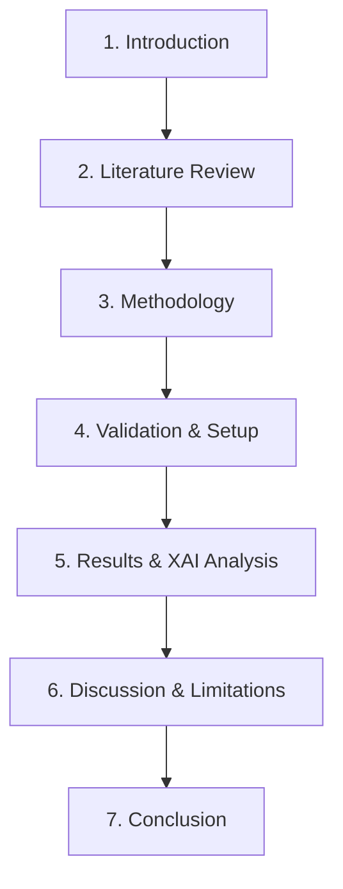

# MSc in AI Project Suitability Feedback: TA-Enhanced Multi-Pair Grid + Trend Bot

This document evaluates the suitability of the **Trading Hummingbot** project as a practical project and dissertation topic for an MSc in AI degree. It highlights the strengths, identifies gaps between a software engineering project and academic research, suggests enhancements for academic rigor, and outlines a thesis structure.

---

## 1. Key Strengths of the Current Codebase

From an academic perspective, the project already incorporates several strong foundational elements:
*   **Regime-Based Formulation:** Rather than trying to predict raw asset prices (which is notoriously noisy), the project focuses on predicting *market regimes* (RANGING vs. TRENDING vs. DANGER). This is a sophisticated and highly active area of quantitative research.
*   **Hybrid Strategy Orchestration:** The combination of heuristic trading logic (technical indicators) with a Machine Learning switching layer (Random Forest regime classifier) provides an excellent case study in hybrid intelligence systems.
*   **MLOps & Production Engineering:** The automation elements (auto-retraining, hot-reloading models without trading downtime, AWS EC2 Docker deployment, Telegram alerts) demonstrate excellent production-level engineering skills.
*   **Advanced Feature Engineering & Dynamic Labeling:** The use of features like the Fractal Dimension Index, Choppiness Index, and dynamic forward-looking labeling (identifying whipsaws/danger relative to volatility/ATR) is academically defensible and practical.

---

## 2. Transitioning from Software Engineering to AI Research

A common issue with MSc projects is presenting a software system rather than a scientific investigation. To achieve an excellent grade, the focus must shift from **how the system was built** to **scientific exploration and evaluation**.

Here are the critical additions required to elevate the project to an academic level:

### A. Multi-Model Comparative Study
Rather than using a single model class (Random Forest/XGBoost), you must compare multiple approaches to show depth of understanding:
1.  **Heuristic Baseline:** A simple rule-based classifier using traditional indicators (e.g., ADX > 25 indicates trending; Choppiness Index thresholds indicate ranging).
2.  **Supervised Machine Learning:** Compare Random Forest, XGBoost, and LightGBM models.
3.  **Unsupervised/Probabilistic Methods:** Implement **Hidden Markov Models (HMMs)** or Gaussian Mixture Models (GMMs) to automatically cluster regimes without using manual future labels. This is highly regarded in financial machine learning research.
4.  **Deep Learning Baseline (Optional):** Evaluate a simple sequence model like an LSTM or Temporal Convolutional Network (TCN) to process the raw OHLCV sequences directly.

### B. Validation Rigor & Preventing Data Leakage
Financial time-series data suffers from severe temporal dependency. Standard k-fold cross-validation is invalid. You should research and implement:
*   **Purged & Embargoed Cross-Validation:** (As defined by Marcos Lopez de Prado in *Advances in Financial Machine Learning*). Because the labeling looks $N$ periods ahead, overlapping candles will leak future information into the training set. You must purge training samples that overlap with test validation periods.
*   **Comprehensive Walk-Forward Optimization (WFO):** Perform multi-year out-of-sample sweeps to demonstrate model robustness across varying market cycles (bear market of 2022 vs. bull market of 2024).

### C. Explainable AI (XAI)
To make your project research-focused, use **SHAP (SHapley Additive exPlanations)** or Permutation Feature Importance to explain the model's decisions:
*   *Which indicators actually matter?* (e.g., does the Choppiness Index drive the "ranging" classification, or is it the Aroon Oscillator?)
*   *Do feature importances change during different market conditions?* Analyze SHAP value shifts over different years.

### D. Statistical Significance Verification
You must prove that your hybrid strategy's performance is statistically superior to baseline behaviors, not just a result of a lucky trading period. Compare:
1.  *Pure Grid Strategy* (always running the grid engine).
2.  *Pure Trend Strategy* (always running the trend engine).
3.  *Random Regime Switching* (control switcher).
4.  *ML-Driven Regime Switching* (your proposed model).

Evaluate using risk-adjusted return metrics: **Sharpe Ratio, Sortino Ratio, Maximum Drawdown, Calmar Ratio, and Expectancy**. Apply a statistical test (such as the Diebold-Mariano test or bootstrapping) to compare the returns.

---

## 3. Proposed Dissertation / Paper Structure

### Potential Titles
*   *Evaluation of Machine Learning-Driven Regime Classification in Hybrid Algorithmic Trading Systems*
*   *A Hybrid Dual-Engine Algorithmic Strategy Enabled by Real-Time Volatility and Trend Regime Inference*
*   *Mitigating Market Whipsaws: A Machine Learning Regime Switching Gate for Cryptocurrencies*

### Chapter Outline

#### Chapter 1: Introduction
*   **Background:** The challenge of high-volatility financial markets and the limitations of static single-algorithm bots.
*   **Research Question:** Can dynamic machine-learning-based regime classification significantly reduce drawdown and improve risk-adjusted returns compared to single-regime baselines?
*   **Contributions:** Development of a dual-engine trading framework, comparison of supervised and unsupervised regime classifiers, and evaluation of real-time deployment overhead.

#### Chapter 2: Literature Review
*   Traditional Technical Analysis vs. Quantitative Finance.
*   Statistical and machine learning approaches to market regime classification (HMMs, Random Forests, Deep Learning).
*   State-of-the-art MLOps in financial technology.

#### Chapter 3: Methodology
*   **Data Pipeline:** High-frequency OHLCV feed via WebSockets/REST.
*   **Feature Engineering:** Choice and mathematical definitions of volatility, momentum, and microstructure features.
*   **Labeling Strategy:** Dynamic forward-looking whipsaw (DANGER) classification.
*   **Classifier Architectures:** Details of Random Forest, XGBoost, and HMM implementations.
*   **Trading Execution System:** Architecture of the Dual-Engine (Grid + Trend) system and the cross-asset correlation gate.

#### Chapter 4: Experimental & Validation Setup
*   Walk-Forward Optimization (WFO) parameters.
*   Purged & Embargoed Cross-Validation design to prevent data leakage.
*   Transaction fee modeling (BNB rebalancing optimizations) and slippage estimates.

#### Chapter 5: Results
*   **Classification Performance:** Confusion matrices, F1-scores, and probability calibration curves.
*   **Backtesting Performance:** Comparative equity curves, Sharpe/Sortino ratios, and drawdown profiles.
*   **Explainability (XAI):** SHAP analysis explaining model predictions.

#### Chapter 6: Discussion
*   Execution latency and the impact of slippage in real-world deployment.
*   Model failure modes during extreme tail events (black swan market shocks).
*   MLOps trade-offs: performance improvements vs. system complexity.

#### Chapter 7: Conclusion & Future Work
*   Key takeaways (e.g., "The ML switching gate reduced maximum drawdown by X%...").
*   Future avenues: Reinforcement Learning (RL) for dynamic order placement, or Alternative Data integrations (sentiment analysis).
