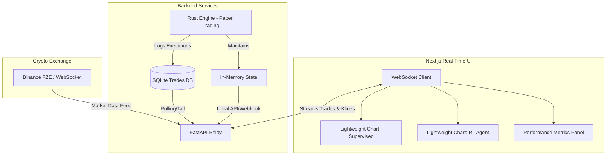

# Real-Time UI Architecture: Engine Performance Benchmarking

**Date:** 2026-07-13
**Status:** Architecture Design
**Goal:** A high-performance real-time UI dashboard to benchmark and compare Supervised vs. Reinforcement Learning policies using live paper trading execution data.

---

## 1. Core Objectives
* **Benchmarking Focus:** Provide a side-by-side visual comparison of how different models (e.g., Random Forest vs. Decision Transformer) perform under identical live market conditions.
* **Real-Time Visualization:** Plot live asset prices (1-second/1-minute OHLCV) and immediately overlay trade execution markers (Buys/Sells) as they happen in paper trading.
* **Metric Tracking:** Display live risk-adjusted return metrics (Sharpe Ratio, Max Drawdown, Cumulative PnL) for each active engine.

## 2. Technology Stack Selection
To achieve the goal of rendering multiple real-time charts simultaneously without lag while maintaining a clean, modern UI:

* **Frontend Framework:** **Next.js (React)** 
  * Why: Provides robust state management for handling high-frequency WebSocket streams, and there is already an existing `next` directory stub in the repository.
* **Charting Library:** **TradingView Lightweight Charts**
  * Why: An HTML5 canvas-based charting library specifically built for financial data. It can render 60fps real-time data and overlay multiple series (e.g., Grid levels, EMA bands) and markers (Buy/Sell arrows) efficiently.
* **Backend / API Relay:** **FastAPI + WebSockets**
  * Why: The Rust Trading Engine operates locally and logs trades/state. A lightweight Python FastAPI sidecar can read the Rust engine's SQLite `trades` table and internal state, broadcasting them to the Next.js frontend via WebSockets.

---

## 3. System Architecture & Data Flow

## 4. Key UI Components

### A. The Engine Comparison Dashboard
The primary view splits the screen to show the active policies side-by-side:
* **Left Panel:** Supervised Regime-Switching Router
* **Right Panel:** Reinforcement Learning Policy (Decision Transformer / PPO)

### B. Live Charting (Lightweight Charts)
Each panel contains a real-time chart configured as follows:
* **Candlestick Series:** Live OHLCV data streaming from the exchange.
* **Markers:** 
  * ⬆️ Green Arrow Below Candle: Buy Order Filled
  * ⬇️ Red Arrow Above Candle: Sell Order Filled
* **Overlays:** EMA 200, Bollinger Bands, and dynamic grid levels (if applicable).

### C. Real-Time Metrics Strip
A persistent header/footer showing live comparison metrics calculated dynamically from the paper-trading execution feeds:
* **Total PnL:** (Supervised vs. RL)
* **Active Drawdown:** (Supervised vs. RL)
* **Win Rate:** Calculated based on closed trades in the session.
* **Current Regime State:** E.g., RANGING vs. TRENDING as inferred by the respective ML models.

## 5. Handling High-Frequency Data
To ensure the UI remains responsive and does not suffer from memory leaks over long paper trading sessions:
1. **Data Throttling:** The FastAPI relay should batch WebSocket updates every 500ms instead of pushing on every single tick.
2. **Rolling Buffers:** The Next.js state should maintain a fixed-size buffer for candlestick data (e.g., last 1000 candles). Older data is flushed from memory unless requested via historical pagination.
3. **Optimistic Rendering:** Use Lightweight Charts' native `update()` methods to append single data points directly to the canvas rather than triggering full React re-renders.
